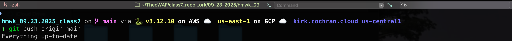

# BAM 3.2
## Creating a New Branch and Merging Changes via `Git Merge`

### 1. Create a New Branch
- Run `git switch -c <branch-name>` to create a new branch.
  

---

### 2. Modify the Branch
- Edit, delete, or create new files, then run `git add` and/or `git rm`.
  

---

### 3. Stage and Commit Changes
- Stage changes by running `git commmit -m "<message information>"`.
  

---

### 4. Push Branch to GitHub
- Run `git push -u origin <branch-name>` to push the branch to GitHub.
  

---

### 5. Verify Branch on GitHub
- Go to your GitHub repo and check the branch activity.
  

---

### 6. Switch Back to Main
- Run `git switch main` to switch back to the main branch.
  

---

### 7. Merge the Branch to the Main Branch
- Run `git merge <branch-name>` to merge the branch into the main branch.
  

---

### 8. Push Merged Main Branch to GitHub
- Run `git push origin main` to push the merged main branch to GitHub.
  

---

### 9. Verify Main Has the Updates

- Check the main branch on GitHub to view changes from the merge.
  

---

### 10. Delete the Local Branch
- Run `git branch -d <branch-name>` to delete the local branch.
  

---

### 11. Delete the Remote Branch on GitHub
Run `git push origin --delete <branch-name>` to delete the remote branch on GitHub.
  

---

### 12. Verify the Branch is Deleted
- Check the main repo on GitHub to confirm the branch has been deleted.
  

---
### <ins>References</ins>
References
Git Cheat Sheet: https://git-scm.com/cheat-sheet

Delete Remote Branch: https://stackoverflow.com/questions/2003505/how-do-i-delete-a-git-branch-locally-and-remotely